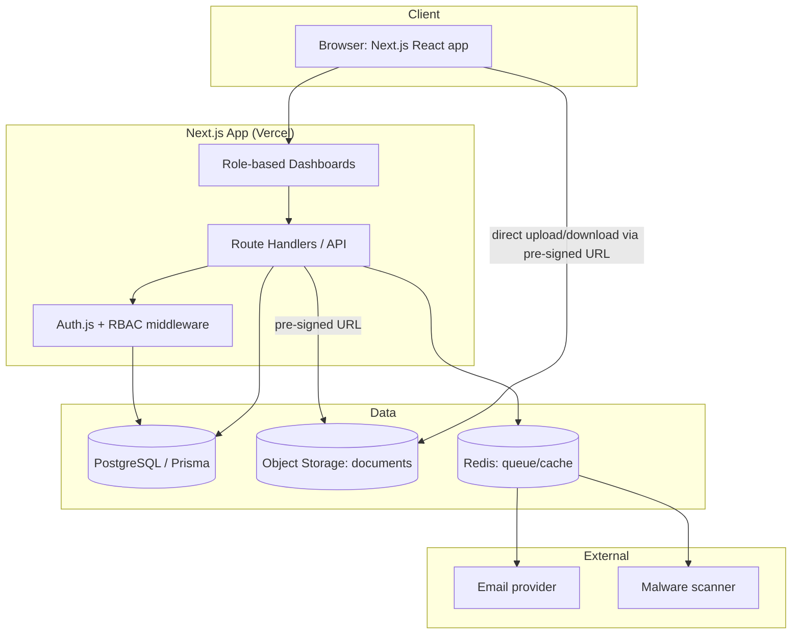
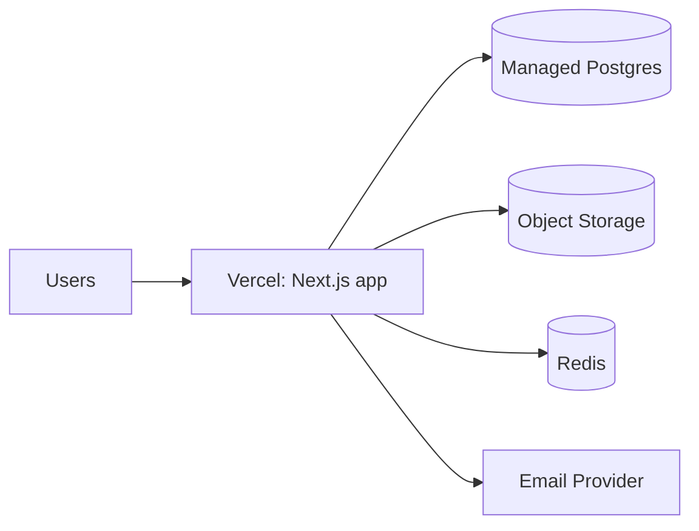

# System Architecture — Study Abroad Application Portal

**Status:** Draft v1
**Last updated:** 2026-07-24

Companion to [PRD.md](./PRD.md), [DATA_MODEL.md](./DATA_MODEL.md), and [SECURITY.md](./SECURITY.md).

---

## 1. Technology Stack

| Layer | Choice | Rationale |
|-------|--------|-----------|
| Frontend | **Next.js (App Router) + TypeScript + Tailwind CSS** | One codebase for all role dashboards; SSR for auth-gated pages. |
| UI components | shadcn/ui (Radix + Tailwind) | Accessible primitives, fast to build consistent dashboards. |
| Backend | **Next.js Route Handlers** (`/app/api`) in TypeScript | Co-located API; can extract to a NestJS service later if needed. |
| Validation | **Zod** | Schema validation at every system boundary (shared client/server). |
| ORM / DB | **Prisma + PostgreSQL** | Relational data fits the domain; type-safe queries + migrations. |
| Auth | **Auth.js (NextAuth)** with JWT sessions + custom RBAC | Email/password + email verification; role & agency in the token. |
| File storage | **S3-compatible object storage** (AWS S3 / Cloudflare R2) | Documents stored as objects, served via short-lived pre-signed URLs. |
| Email | **Resend** (or SendGrid) | Transactional email: verification, status changes, doc decisions. |
| Background jobs | Queue (e.g. **BullMQ + Redis**) or Vercel Cron | Malware scan, zip bundling, notification fan-out. |
| Zip bundling | Server-side stream (e.g. `archiver`) | Agent "download all documents" as a single archive. |
| Hosting | **Vercel** (app) + **Neon/Supabase/RDS** (Postgres) + R2/S3 (files) | Managed, scalable, low ops. |
| Testing | Vitest (unit), Playwright (E2E), Prisma test DB (integration) | Meets 80% coverage target across unit/integration/E2E. |

> **Immutability note:** follow the project coding standard — API and domain layers return new
> objects rather than mutating inputs; state changes go through explicit transition functions.

---

## 2. High-Level Component Diagram



Documents never stream through the API server for storage — the client uploads/downloads **directly**
to object storage using short-lived pre-signed URLs the API issues after an authorization check.

---

## 3. Request & Auth Flow

1. User authenticates via Auth.js → receives a session JWT containing `userId`, `role`, `agencyId`.
2. Every Route Handler runs **RBAC middleware** that:
   - confirms the session,
   - checks the role is permitted for the route,
   - enforces **row-level scoping** (agents see only assigned students; agency admins see only their agency).
3. For document access, the API verifies the caller is authorized for that specific document, then
   issues a pre-signed URL valid for a few minutes.

---

## 4. RBAC Matrix

| Capability | Student | Agent | Agency Admin | Super Admin |
|------------|:------:|:-----:|:------------:|:-----------:|
| Manage own profile | ✅ | ✅ | ✅ | ✅ |
| Browse catalog | ✅ | ✅ | ✅ | ✅ |
| Create/submit application | ✅ (own) | — | — | — |
| Upload own documents | ✅ | — | — | — |
| Review/approve documents | — | ✅ (assigned) | — | — |
| Download document bundle | — | ✅ (assigned) | ✅ (own agency) | ✅ |
| Advance pipeline stage | — | ✅ (assigned) | — | — |
| Submit to university | — | ✅ (assigned) | — | — |
| Manage agents | — | — | ✅ (own agency) | ✅ |
| Assign students to agents | — | — | ✅ (own agency) | ✅ |
| View reporting | — | own caseload | ✅ (own agency) | ✅ (global) |
| Manage catalog & RequirementSets | — | — | — | ✅ |
| Onboard agencies | — | — | — | ✅ |
| View audit log | — | — | own agency | global |

**Data isolation rule:** all queries are scoped by `agencyId` (and by `assignment` for agents) at the
repository layer — never rely on the UI to hide data.

---

## 5. Folder Structure (proposed)

```
student-portal/
├─ docs/                      # these planning docs
├─ prisma/
│  ├─ schema.prisma
│  └─ migrations/
├─ src/
│  ├─ app/
│  │  ├─ (auth)/              # login, register, verify
│  │  ├─ (student)/           # student dashboards
│  │  ├─ (agent)/             # agent dashboards
│  │  ├─ (admin)/             # agency + super admin
│  │  └─ api/                 # route handlers
│  ├─ server/
│  │  ├─ auth/                # Auth.js config, RBAC middleware
│  │  ├─ repositories/        # data access (agency-scoped)
│  │  ├─ services/            # domain logic (eligibility, pipeline, docs)
│  │  ├─ state-machine/       # application status transitions
│  │  └─ storage/             # pre-signed URL issuance
│  ├─ lib/                    # shared utils, zod schemas, api envelope
│  ├─ components/             # shared UI
│  └─ types/
├─ tests/                     # unit / integration / e2e
└─ ...config
```

Following the "many small files" standard: repositories, services, and route handlers are split by domain
(auth, catalog, application, document, agency, reporting), each 200–400 lines.

---

## 6. API Conventions

Consistent response envelope for every endpoint:

```json
{ "success": true,  "data": { }, "error": null, "meta": { "page": 1, "limit": 20, "total": 0 } }
{ "success": false, "data": null, "error": "Human-readable message", "meta": null }
```

- REST resource routing: `/api/applications`, `/api/applications/:id/documents`, etc.
- Zod-validated request bodies; typed responses.
- Pagination, filtering, and sorting on all list endpoints.
- Rate limiting on auth and upload endpoints.

---

## 7. Repository Pattern

Business logic depends on repository interfaces, not Prisma directly, so storage is swappable and testable:

```
findAll / findById / create / update / delete   (+ agency/assignment scope on every call)
```

Services (e.g. `EligibilityService`, `PipelineService`, `DocumentService`) hold domain rules and call
repositories. Route handlers are thin controllers: validate → call service → return envelope.

---

## 8. Notifications & Background Work

- Status change / document decision → enqueue job → send email + write in-app notification.
- Document upload → enqueue malware scan → on pass mark `clean`, on fail mark `rejected` + notify.
- Bundle download → stream zip of approved documents (generated on demand or via job for large sets).

---

## 9. Deployment Topology



- Environments: `local` → `staging` → `production`, each with isolated DB and bucket.
- Secrets via environment variables / platform secret manager (never in code).
- CI runs lint, typecheck, unit + integration tests, and a security scan on every PR.

See [SECURITY.md](./SECURITY.md) for the full security design and [ROADMAP.md](./ROADMAP.md) for phasing.
