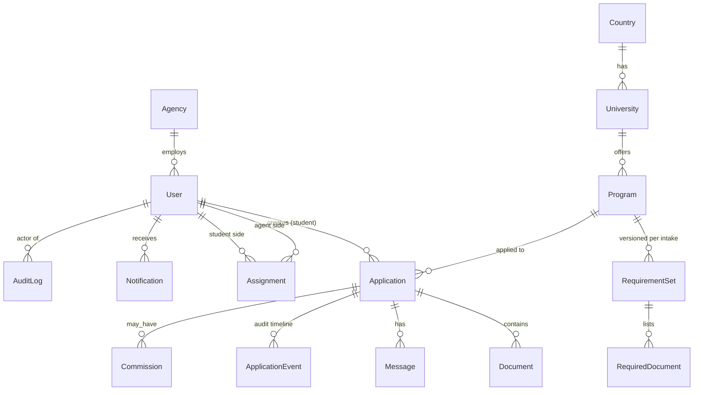
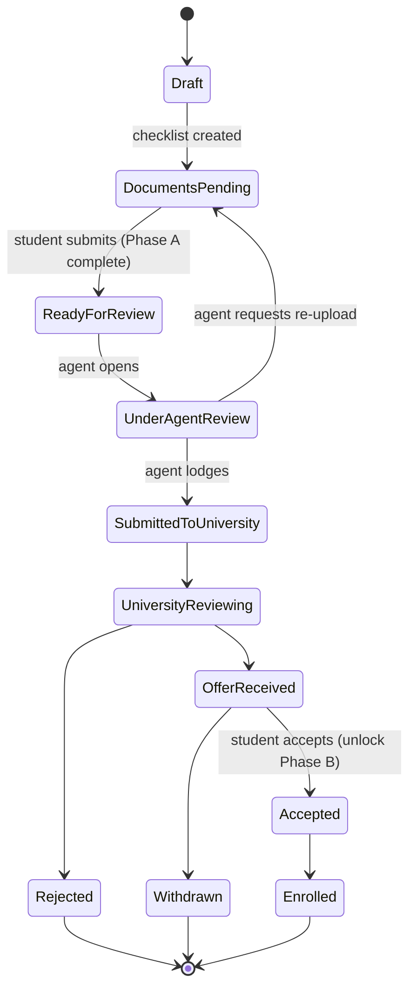

# Data Model — Study Abroad Application Portal

**Status:** Draft v1
**Last updated:** 2026-07-24

Companion to [ARCHITECTURE.md](./ARCHITECTURE.md) and [PRD.md](./PRD.md).

---

## 1. Entity Overview



---

## 2. Core Entities

### Agency
| Field | Type | Notes |
|-------|------|-------|
| id | uuid (PK) | |
| name | string | |
| status | enum(`active`,`suspended`) | |
| createdAt / updatedAt | timestamp | |

### User
| Field | Type | Notes |
|-------|------|-------|
| id | uuid (PK) | |
| role | enum(`student`,`agent`,`agency_admin`,`super_admin`) | |
| agencyId | uuid (FK, nullable) | null for super_admin |
| email | string (unique) | |
| passwordHash | string | Argon2/bcrypt |
| emailVerifiedAt | timestamp (nullable) | |
| status | enum(`invited`,`active`,`disabled`) | |
| createdAt / updatedAt | timestamp | |

### StudentProfile (1:1 with User where role = student)
| Field | Type | Notes |
|-------|------|-------|
| userId | uuid (PK, FK) | |
| fullName, dateOfBirth, nationality, phone | | |
| educationHistory | jsonb | list of {level, institution, gpa, gpaScale, year} |
| testScores | jsonb | {ielts, toefl, pte, duolingo, gre, gmat, ...} |
| budgetAnnual | int (nullable) | in USD |
| targetIntake | string | e.g. "Fall 2026" |

---

## 3. Catalog Entities

### Country
`id, name, isoCode, active`

### University
`id, countryId (FK), name, city, ranking (nullable), active`

### Program
| Field | Type | Notes |
|-------|------|-------|
| id | uuid (PK) | |
| universityId | uuid (FK) | |
| name | string | e.g. "MSc Computer Science" |
| degreeLevel | enum(`bachelor`,`master`,`phd`,`diploma`) | |
| discipline | string | subject area |
| durationMonths | int | |
| tuitionAnnual | int | |
| active | bool | |

### RequirementSet (versioned per program + intake)
| Field | Type | Notes |
|-------|------|-------|
| id | uuid (PK) | |
| programId | uuid (FK) | |
| intake | string | e.g. "Fall 2026" |
| version | int | supersedes prior versions |
| minGpa / gpaScale | decimal | academic threshold |
| minIelts / minToefl / minPte / minDuolingo | decimal (nullable) | English thresholds |
| applicationDeadline | date | |
| applicationFee | int | |
| active | bool | |

### RequiredDocument (rows of a RequirementSet)
| Field | Type | Notes |
|-------|------|-------|
| id | uuid (PK) | |
| requirementSetId | uuid (FK) | |
| documentType | enum (see §6) | |
| phase | enum(`core`,`post_admission`) | drives the two-phase model |
| required | bool | |
| notes | string (nullable) | |

---

## 4. Application & Documents

### Assignment (agent ↔ student)
`id, agencyId (FK), agentUserId (FK), studentUserId (FK), createdAt` — unique on (agentUserId, studentUserId).

### Application
| Field | Type | Notes |
|-------|------|-------|
| id | uuid (PK) | |
| studentUserId | uuid (FK) | |
| agencyId | uuid (FK) | denormalized for scoping |
| assignedAgentUserId | uuid (FK, nullable) | |
| programId | uuid (FK) | |
| requirementSetId | uuid (FK) | snapshot of the set used |
| intake | string | |
| stage | enum (see §5) | current pipeline stage |
| eligibilityResult | enum(`eligible`,`borderline`,`not_eligible`) | computed at creation, re-checkable |
| universityReference | string (nullable) | set when submitted to university |
| submittedToAgentAt / submittedToUniversityAt / decisionAt | timestamp (nullable) | |
| createdAt / updatedAt | timestamp | |

### Document
| Field | Type | Notes |
|-------|------|-------|
| id | uuid (PK) | |
| applicationId | uuid (FK) | |
| documentType | enum | matches a RequiredDocument |
| phase | enum(`core`,`post_admission`) | |
| storageKey | string | object storage key (never a public URL) |
| fileName / mimeType / sizeBytes | | |
| version | int | re-uploads increment; keep history |
| scanStatus | enum(`pending`,`clean`,`infected`) | malware scan result |
| reviewStatus | enum(`pending`,`approved`,`rejected`,`reupload_requested`) | |
| reviewReason | string (nullable) | required when rejected/reupload |
| reviewedByUserId | uuid (FK, nullable) | |
| uploadedAt / reviewedAt | timestamp | |

---

## 5. Application State Machine



**Transition rules (enforced in `PipelineService`):**
- `DocumentsPending → ReadyForReview` requires all `required && phase=core` documents `approved`-or-`pending`
  and uploaded (submission allowed once uploaded; approval happens in review).
- Only the **assigned agent** may perform agent-side transitions.
- Only the **owning student** may accept/decline an offer.
- `Accepted` unlocks Phase B (`post_admission`) documents on the checklist.
- Every transition writes an `ApplicationEvent`.

### Document review lifecycle
```
pending → approved
pending → rejected (reason required)
pending → reupload_requested (reason required) → (new version) pending
```

---

## 6. Enums — Document Types

`transcript`, `diploma`, `english_test`, `passport`, `sop`, `recommendation_letter`, `cv`,
`financial_proof`, `sponsor_letter`, `visa_document`, `medical`, `insurance`, `accommodation`, `other`.

Each type maps to a `phase` via the RequirementSet, not hardcoded on the enum.

---

## 7. Supporting Entities

### Message
`id, applicationId (FK), senderUserId (FK), body (text), createdAt, readAt (nullable)`

### ApplicationEvent (per-application audit timeline)
`id, applicationId (FK), actorUserId (FK), fromStage, toStage, note, createdAt`

### Notification
`id, userId (FK), type, payload (jsonb), readAt (nullable), createdAt`

### Commission (v1: manual records)
`id, applicationId (FK), agencyId (FK), amount, currency, status(enum), note, createdAt`

### AuditLog (global security log — separate from ApplicationEvent)
`id, actorUserId (FK), action, resourceType, resourceId, ip, userAgent, metadata (jsonb), createdAt`
Records sensitive actions especially **document views and downloads**.

---

## 8. Prisma Schema Draft (excerpt)

```prisma
enum Role { student agent agency_admin super_admin }
enum ApplicationStage {
  draft documents_pending ready_for_review under_agent_review
  submitted_to_university university_reviewing offer_received
  accepted rejected withdrawn enrolled
}
enum ReviewStatus { pending approved rejected reupload_requested }
enum ScanStatus { pending clean infected }
enum DocPhase { core post_admission }

model Agency {
  id        String   @id @default(uuid())
  name      String
  status    String   @default("active")
  users     User[]
  createdAt DateTime @default(now())
  updatedAt DateTime @updatedAt
}

model User {
  id              String    @id @default(uuid())
  role            Role
  agencyId        String?
  agency          Agency?   @relation(fields: [agencyId], references: [id])
  email           String    @unique
  passwordHash    String
  emailVerifiedAt DateTime?
  status          String    @default("invited")
  profile         StudentProfile?
  applications    Application[] @relation("StudentApplications")
  createdAt       DateTime  @default(now())
  updatedAt       DateTime  @updatedAt
}

model Application {
  id                     String           @id @default(uuid())
  studentUserId          String
  student                User             @relation("StudentApplications", fields: [studentUserId], references: [id])
  agencyId               String
  assignedAgentUserId    String?
  programId              String
  requirementSetId       String
  intake                 String
  stage                  ApplicationStage @default(draft)
  eligibilityResult      String
  universityReference    String?
  submittedToAgentAt     DateTime?
  submittedToUniversityAt DateTime?
  decisionAt             DateTime?
  documents              Document[]
  events                 ApplicationEvent[]
  messages               Message[]
  createdAt              DateTime         @default(now())
  updatedAt              DateTime         @updatedAt

  @@index([agencyId, stage])
  @@index([assignedAgentUserId])
}

model Document {
  id             String       @id @default(uuid())
  applicationId  String
  application    Application  @relation(fields: [applicationId], references: [id])
  documentType   String
  phase          DocPhase
  storageKey     String
  fileName       String
  mimeType       String
  sizeBytes      Int
  version        Int          @default(1)
  scanStatus     ScanStatus   @default(pending)
  reviewStatus   ReviewStatus @default(pending)
  reviewReason   String?
  reviewedByUserId String?
  uploadedAt     DateTime     @default(now())
  reviewedAt     DateTime?

  @@index([applicationId])
}
```

*(Full schema — StudentProfile, Country/University/Program, RequirementSet, RequiredDocument, Assignment,
Notification, Commission, AuditLog — is built out in Phase 0.)*

---

## 9. Indexing & Integrity Notes

- Index applications by `(agencyId, stage)` and `assignedAgentUserId` for dashboard queries.
- `requirementSetId` is **snapshotted** onto the Application so later catalog edits don't retroactively
  change a submitted application's requirements.
- Soft-delete (status flags) preferred over hard deletes for auditability.
- All foreign keys enforced at the DB level; cascade rules chosen per relation (documents cascade with
  application; audit logs never cascade).
