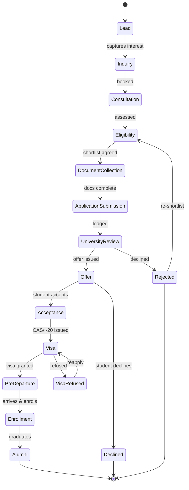
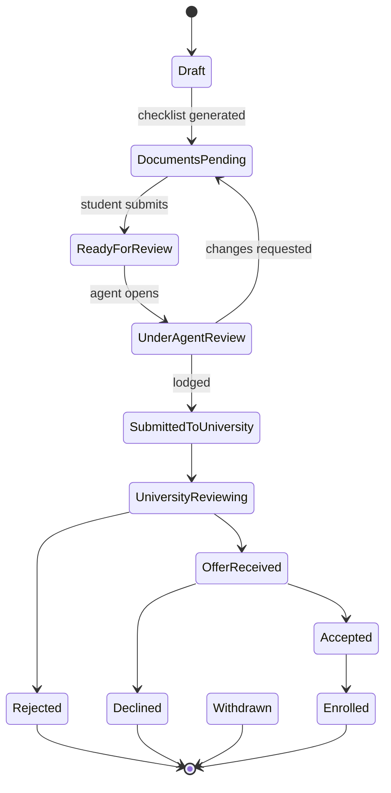
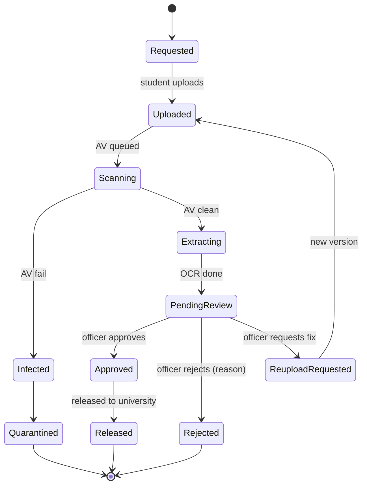
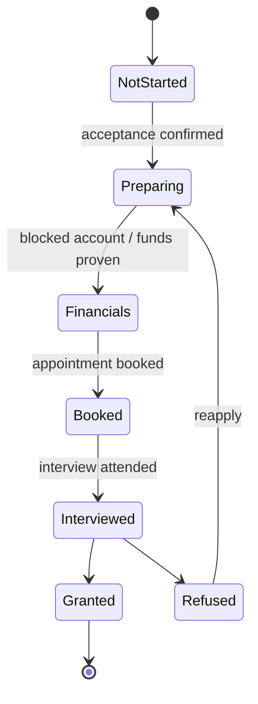

# State Machines

**Status:** Draft v1 · **Date:** 2026-07-25

The platform is state-machine-driven: every consequential entity has an explicit, guarded
lifecycle. Transitions are the **only** way state changes; each emits a domain event
(ADR-003) and writes an audit entry. Illegal transitions are rejected at the service layer
and unrepresentable in the UI.

Contexts model four cooperating machines: **Student Journey** (the master), and the
**Application**, **Document**, and **Visa** sub-machines.

---

## 1. Student Journey (master lifecycle)

| Stage | Owner (role) | Entry guard | Emits |
|-------|-------------|-------------|-------|
| Lead | Counsellor | source captured | `lead.created` |
| Inquiry | Counsellor | contact verified | `inquiry.opened` |
| Consultation | Counsellor | appointment held | `consultation.completed` |
| Eligibility | Counsellor + AI | profile complete | `eligibility.assessed` |
| DocumentCollection | Student + DocVO | shortlist ≥ 1 program | `documents.requested` |
| ApplicationSubmission | Agent | core docs verified | `application.submitted` |
| UniversityReview | University Partner | lodged w/ reference | `application.underReview` |
| Offer | University Partner | decision recorded | `offer.received` |
| Acceptance | Student | offer accepted | `offer.accepted` |
| Visa | Student + Compliance | CAS/I-20 present | `visa.started` |
| PreDeparture | Counsellor | visa granted | `visa.granted` |
| Enrollment | Counsellor | enrolment confirmed | `student.enrolled` |
| Alumni | System | graduation | `student.alumni` |

A student may pursue **multiple applications** concurrently; the master stage reflects the
**furthest-progressed** application, with per-application detail in the sub-machine.

---

## 2. Application sub-machine

> This is the machine already implemented in the MVP; it extends cleanly with `Declined`
> and the university-partner transitions. Guards: only the **assigned agent** performs
> agent-side transitions; only the **owning student** accepts/declines; university-side
> transitions require the **University Partner** of the routed org.

---

## 3. Document sub-machine

Guards: transition to `Approved`/`Released` requires `document:approve`/`document:release`
permission (matrix §3). `Infected` files are quarantined, never downloadable, and raise a
compliance event. Re-uploads create a **new immutable version** (no overwrite).

---

## 4. Visa sub-machine

Country-specific requirements (e.g., Germany: no APS for Bangladesh, ~€11,904 blocked
account) are **data**, attached to the visa case via the country/requirement config — not
hard-coded into the machine.

---

## 5. Invariants (all machines)

1. Transitions are **total functions** validated by a guard table; unknown transitions throw.
2. Each transition runs in a DB transaction that writes the new state **+ outbox event +
   audit row** atomically.
3. Actors are authorized per the Role–Permission Matrix before a transition is allowed.
4. Terminal states have no outgoing transitions (except explicit reopen paths shown above).
5. Every machine is **unit-tested exhaustively** (allowed vs forbidden transitions, per role).
6. UIs render only the transitions the current user is permitted to perform (no dead buttons).
